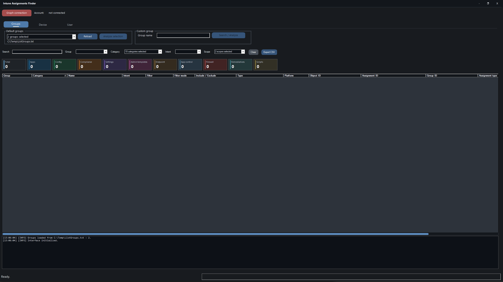

# Intune Assignments Finder

A small PowerShell GUI tool to quickly see where your Intune resources are assigned.

Connect to Microsoft Graph, pick a group, device, or user, and the tool brings back Intune assignments in a filterable grid with CSV export.



## ✨ Features

- 🔍 Check assignments by group, device, or user
- 📱 Detect `All devices` and `All users` assignments
- 🎯 Show Intune categories such as apps, compliance, configuration, scripts, remediations, and more
- 🧭 Search devices by name, serial number, Intune ID, or Azure AD device ID
- 🧑‍💼 Search users by email or UPN
- 🔐 Interactive Microsoft Graph sign-in, scoped to work or school accounts
- 🔄 Toggle Microsoft Graph connection from the main button: connect, disconnect, then reconnect when needed
- 📊 Windows Forms interface with quick filters and an integrated log console
- 📤 CSV export in UTF-8 with `;` separator
- 🧾 Audit-only behavior: no Intune assignment is modified

## 📋 Prerequisites

### PowerShell

- Windows with PowerShell 5.1 or PowerShell 7+
- PowerShell 7 is recommended for a smoother experience
- Check your version with:

```powershell
$PSVersionTable.PSVersion
```

### PowerShell Module

The script uses the Microsoft Graph authentication module:

```powershell
Microsoft.Graph.Authentication
```

If the module is missing, the tool shows an installation message and stops. Install it with one of these commands, then restart the tool:

```powershell
Install-Module Microsoft.Graph.Authentication -Scope CurrentUser
```

or, for all users:

```powershell
Install-Module Microsoft.Graph.Authentication -Scope AllUsers
```

### Graph Permissions

The following scopes are requested during sign-in:

| Permission | Used for |
| --- | --- |
| `Group.Read.All` | Read Entra ID groups |
| `Directory.Read.All` | Read tenant directory objects |
| `DeviceManagementApps.Read.All` | Read Intune applications |
| `DeviceManagementConfiguration.Read.All` | Read Intune configurations and policies |
| `DeviceManagementManagedDevices.Read.All` | Read Intune managed devices |
| `DeviceManagementServiceConfig.Read.All` | Read Intune service configuration |

Depending on your tenant settings, admin consent may be required.

## 🚀 Start

From the project folder:

```powershell
powershell -NoProfile -File .\IntuneAssignmentsFinder.ps1
```

With PowerShell 7:

```powershell
pwsh -NoProfile -File .\IntuneAssignmentsFinder.ps1
```

The app opens as a centered normal window.

Then:

1. Click `Graph connection`.
2. Sign in with your work account.
3. Once connected, the button turns green and changes to `Disconnect Graph`.
4. Run an analysis from `Groups`, `Device`, or `User`.
5. Filter the results if needed.
6. Export to CSV when ready.

To disconnect from Microsoft Graph, click `Disconnect Graph`. The button returns to `Graph connection`, and clicking it again starts a new authentication flow.

## 🔐 Microsoft Graph Sign-In

On Windows, sign-in by Web Account Manager (WAM) is enabled by default. If you start the tool from an embedded terminal, such as the VS Code terminal, the interactive browser window may be hidden behind other windows.

The tool writes this reminder both to the PowerShell console and to the integrated log console before starting Microsoft Graph authentication.

If the interactive sign-in window cannot be opened, the tool falls back to device code sign-in and displays instructions.

## 📦 What It Checks

- Intune applications
- Configuration profiles
- Settings catalog
- Compliance policies
- Administrative templates
- Endpoint security
- Remediations
- Intune PowerShell scripts

## 🧩 Default Groups

The default group list is loaded from:

```text
C:\Temp\ListGroups.txt
```

Use one group name per line.

## 🛠 Troubleshooting

### Graph Sign-In Issues

Close all PowerShell consoles and start clean, ideally with PowerShell 7:

```powershell
pwsh -NoProfile -File .\IntuneAssignmentsFinder.ps1
```

If you see a Microsoft Graph Authentication version conflict, update or reinstall the authentication module:

```powershell
Install-Module Microsoft.Graph.Authentication -Scope CurrentUser -Force -AllowClobber
```

If the sign-in browser appears to be missing, check behind other windows, especially when launching the tool from an embedded terminal.

### Script Execution Is Blocked

```powershell
Set-ExecutionPolicy -Scope CurrentUser RemoteSigned
```

### Module Install Fails

Check access to PowerShell Gallery, corporate proxy settings, TLS, or workstation restrictions.

## 🤖 AI-Built

This tool was built with AI assistance, from the PowerShell GUI to the README.
